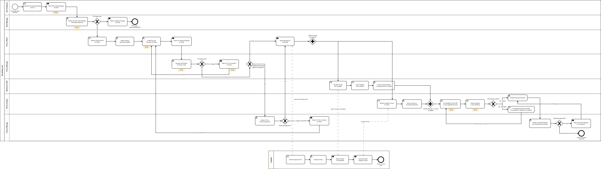

# As-Is Procure-to-Pay Process Analysis

## 1. Analysis Purpose

This section analyzes NovaRetail's current Procure-to-Pay process to understand how purchasing activities are performed across Store Operations, Procurement, Warehouse, and Finance & Accounting.

The purpose of the As-Is analysis is to:

* understand the current workflow;
* identify manual activities and process handoffs;
* locate major pain points and bottlenecks;
* identify data and control gaps;
* determine the root causes of key process issues;
* establish clear inputs for the future To-Be process.

The As-Is model intentionally preserves the current manual activities, email-based approvals, fragmented information sources, and manual matching activities because these represent the existing process that needs to be improved.

---

## 2. Process Boundary

The analysis covers the Procure-to-Pay process from the point where a purchasing need is identified until the related payment request is approved.

### Process Start

The process begins when a Store Employee or authorized requester identifies a need to purchase goods, supplies, equipment, or operating services.

### Process End

The process ends when:

* the supplier invoice has been reviewed;
* three-way matching has been completed;
* relevant exceptions have been resolved;
* the payment request has been approved.

Actual payment execution through the banking system is outside the scope of this process.

### High-Level Flow

```text
Purchasing Need
      ↓
Purchase Requisition
      ↓
PR Approval
      ↓
Supplier Selection
      ↓
Purchase Order
      ↓
PO Approval
      ↓
Supplier Fulfillment
      ↓
Goods Receipt
      ↓
Supplier Invoice
      ↓
Three-Way Matching
      ↓
Exception Handling
      ↓
Payment Approval
```

---

## 3. Process Participants

| Participant                | Role in the As-Is Process                                                           |
| -------------------------- | ----------------------------------------------------------------------------------- |
| Requester / Store Employee | Identifies purchasing needs and prepares the Purchase Requisition                   |
| Store Manager              | Reviews and approves or rejects the Purchase Requisition                            |
| Procurement Officer        | Reviews approved PRs, selects an approved supplier, and prepares the Purchase Order |
| Procurement Manager        | Reviews Purchase Orders and performs procurement approval                           |
| Warehouse Staff            | Receives goods and records Goods Receipt information                                |
| AP Accountant              | Receives supplier invoices and performs three-way matching                          |
| Finance Manager            | Performs additional financial control and approves payment requests                 |
| Supplier                   | Receives Purchase Orders, delivers goods, and sends invoices                        |

The Supplier is modeled as an external participant because it operates outside NovaRetail.

---

## 4. As-Is BPMN



[Open the editable Draw.io diagram](https://app.diagrams.net/#G1DY7h19HGXCIOLIl10G2CIp9fzg-Cxf_B#%7B%22pageId%22%3A%22VZPugXlF1knfDJKrDQvl%22%7D)

The BPMN model represents the current process rather than the proposed future solution.

For example:

* Purchase Requisitions are prepared using spreadsheets.
* Approval activities depend on email communication.
* Procurement data is maintained across multiple files and systems.
* Purchase Order data may need to be entered again from the original Purchase Requisition.
* Goods Receipt and Invoice information are maintained by different business functions.
* Three-way matching is performed manually.
* Transaction status and approval history are not centrally available.

These characteristics are intentionally retained because they form the basis of the As-Is analysis.

---

## 5. Current Process Walkthrough

### 5.1 Purchase Requisition Creation

The process begins when a Store Employee or requester identifies a purchasing need.

The requester prepares a Purchase Requisition using Excel and records information such as:

* requested item or service;
* quantity;
* estimated price;
* required date;
* purchasing reason;
* requesting store or department.

The Purchase Requisition is then sent to the Store Manager through email.

**Observation:**
The procurement transaction does not begin within a centralized workflow. Information is initially stored in a spreadsheet and communicated through email.

**Related Pain Points:** PP-02, PP-04, PP-07.

---

### 5.2 Purchase Requisition Approval

The Store Manager receives the Purchase Requisition by email and reviews the purchasing request.

Budget information may need to be checked separately because procurement and budget information are not managed through a single process.

The manager then either approves or rejects the request.

If the request is rejected, the current process ends or the requester may need to prepare a revised request.

**Observation:**
Approval information is maintained through email communication, while budget control is performed manually and may not be applied consistently.

**Related Pain Points:** PP-04, PP-05, PP-06.

---

### 5.3 Procurement Processing

After the Purchase Requisition is approved, the Procurement Officer receives the request and reviews the purchasing information.

The Procurement Officer selects an existing approved supplier and prepares the corresponding Purchase Order.

Because the original PR and PO are maintained separately, information from the Purchase Requisition may need to be entered again when the Purchase Order is created.

**Observation:**
Existing transaction information is not automatically reused between process stages.

**Related Pain Points:** PP-02, PP-07.

---

### 5.4 Purchase Order Approval

The Procurement Officer sends the Purchase Order to the Procurement Manager for approval through email.

The Procurement Manager reviews information such as:

* supplier;
* items;
* quantities;
* prices;
* total value;
* purchasing justification.

If the Purchase Order is rejected or requires correction, it is returned to the Procurement Officer.

Some Purchase Orders may also require additional financial approval depending on applicable approval rules.

**Observation:**
The main source of delay is not necessarily the review activity itself, but the waiting time created by email-based approval and manual follow-up.

**Related Pain Points:** PP-01, PP-04, PP-05.

---

### 5.5 Supplier Fulfillment

After approval, the Procurement Officer sends the Purchase Order to the selected supplier.

The supplier receives the Purchase Order, prepares the requested goods, and delivers them to NovaRetail.

The supplier also issues the corresponding invoice.

Because the supplier is external to NovaRetail, these interactions are represented using BPMN Message Flows.

---

### 5.6 Goods Receipt

Warehouse Staff receive the delivered goods and compare the delivery with the Purchase Order.

The receiving activity includes checking:

* quantity;
* item;
* delivery condition;
* partial or complete receipt.

The warehouse then records Goods Receipt information.

This information may be stored separately from procurement and accounting records.

**Observation:**
Goods Receipt information is not necessarily available immediately to Procurement or Accounts Payable through a shared transaction record.

**Related Pain Points:** PP-02, PP-04, PP-07.

---

### 5.7 Supplier Invoice Processing

The supplier sends an invoice to NovaRetail.

The AP Accountant receives the invoice and identifies the related Purchase Order and Goods Receipt.

Because these documents may be stored in different sources, the AP Accountant may need to locate and collect the relevant transaction information manually.

**Observation:**
Invoice processing depends on information maintained by different departments and systems.

**Related Pain Points:** PP-02, PP-03.

---

### 5.8 Manual Three-Way Matching

The AP Accountant manually compares:

```text
Purchase Order
      +
Goods Receipt
      +
Supplier Invoice
```

The comparison may include:

* supplier;
* item;
* quantity;
* unit price;
* invoice amount.

If the information matches, the invoice can proceed toward payment approval.

If a discrepancy is identified, additional investigation is required.

**Observation:**
Three-way matching is highly dependent on manual document collection and comparison.

**Related Pain Point:** PP-03.

---

### 5.9 Exception Handling

When the Purchase Order, Goods Receipt, and Supplier Invoice do not match, the AP Accountant investigates the discrepancy.

Depending on the issue, the accountant may need to contact:

* Procurement;
* Warehouse;
* Supplier.

Communication may take place through email, phone calls, or manual checks.

After the discrepancy is resolved, the documents are reviewed again.

**Observation:**
Exception handling depends heavily on manual coordination between multiple parties.

This does not introduce a separate pain point in this case study but reinforces PP-02 and PP-03.

---

### 5.10 Payment Approval

After the invoice is successfully validated, the AP Accountant prepares a Payment Request.

The Finance Manager reviews the Payment Request and the related supporting information.

If approved, the procurement transaction reaches the end of the process analyzed in this project.

If the request is rejected, it is returned for correction or further review.

**Process End:**
Payment Request Approved.

---

## 6. Pain Point Analysis

Seven key pain points were identified during the As-Is analysis.

| ID    | Process Area                       | As-Is Observation                                                                                   | Business Impact                                                         |
| ----- | ---------------------------------- | --------------------------------------------------------------------------------------------------- | ----------------------------------------------------------------------- |
| PP-01 | PO Approval                        | Purchase Order approval depends on email and manual follow-up                                       | Longer waiting time and delayed PO issuance                             |
| PP-02 | End-to-End P2P Data Flow           | Procurement information is distributed across Excel, email, warehouse records, and accounting tools | Data inconsistency and difficult coordination between departments       |
| PP-03 | Invoice Processing                 | PO, Goods Receipt, and Invoice information are manually compared                                    | Longer invoice processing and risk of missed discrepancies              |
| PP-04 | PR / PO Lifecycle                  | There is no centralized transaction status                                                          | Users must manually request updates and have limited process visibility |
| PP-05 | Approval and Transaction History   | Approval evidence and transaction changes exist across separate emails and files                    | Weak traceability and difficult audit review                            |
| PP-06 | PR Approval                        | Budget checking is manual and inconsistently applied                                                | Purchasing requests may proceed without reliable budget validation      |
| PP-07 | PR to PO and Downstream Processing | Existing information must be entered again across process stages                                    | Additional workload and increased risk of data-entry errors             |

---

## 7. Pain Point Categories

The identified issues can be grouped into three broader categories.

### Process Efficiency

* PP-01 — Approval delay
* PP-03 — Manual three-way matching
* PP-07 — Duplicate data entry

### Data and Visibility

* PP-02 — Fragmented procurement data
* PP-04 — Limited PR/PO status visibility

### Control and Governance

* PP-05 — Limited audit trail
* PP-06 — Inconsistent budget control

This grouping helps distinguish individual operational problems from the broader improvement areas that will later be addressed in the To-Be process.

---

## 8. Bottleneck Analysis

Not every pain point is considered a process bottleneck.

The As-Is analysis identified three major bottlenecks that have the greatest potential to increase cycle time and manual workload.

### 8.1 Bottleneck 1 — Purchase Order Approval Waiting Time

The PO approval process relies on email communication.

```text
PO Prepared
    ↓
Approval Email Sent
    ↓
Waiting for Approver
    ↓
Manager Reviews PO
    ↓
Approval Decision
```

The actual task of reviewing the Purchase Order may take relatively little time.

However, the request may remain in the approver's email queue before it is reviewed.

The primary bottleneck is therefore **waiting time between submission and approval**, rather than the review activity itself.

**Related Pain Point:** PP-01.

---

### 8.2 Bottleneck 2 — Manual Information Handoffs

Procurement information moves between multiple departments and tools.

```text
Purchase Requisition
        ↓
Purchase Order
        ↓
Warehouse Record
        ↓
Accounting Record
```

Each handoff may require:

* manual data entry;
* file transfer;
* email communication;
* manual verification.

These handoffs increase:

* processing time;
* coordination effort;
* risk of inconsistent information;
* risk of data-entry errors.

**Related Pain Points:** PP-02 and PP-07.

---

### 8.3 Bottleneck 3 — Manual Invoice Matching

Accounts Payable must collect information from several sources before an invoice can be approved.

```text
Find Purchase Order
        +
Find Goods Receipt
        +
Review Supplier Invoice
        ↓
Manual Comparison
        ↓
Investigate Discrepancies
```

When transaction volume increases, this activity can become a significant processing constraint for the Accounts Payable function.

**Related Pain Point:** PP-03.

---

## 9. Root Cause Analysis

The project performs root-cause analysis on three high-impact problems rather than treating every identified pain point independently.

---

### RC-01 — Purchase Order Approval Delay

```text
Why is PO approval slow?
        ↓
Approval requests spend time waiting.
        ↓
Why?
Approvers receive requests through email.
        ↓
Why?
There is no centralized approval queue or routing mechanism.
        ↓
Root Cause
Lack of a standardized and controlled PO approval workflow.
```

**Root Cause:**
Lack of a standardized approval workflow.

---

### RC-02 — Fragmented and Repeated Procurement Data

```text
Why is procurement data entered repeatedly?
        ↓
Each department uses different files or tools.
        ↓
Why?
Transaction information is not transferred automatically.
        ↓
Why?
Current tools are not integrated around a single procurement transaction.
        ↓
Root Cause
Lack of an integrated procurement data flow.
```

**Root Cause:**
Lack of an integrated procurement data flow across the Procure-to-Pay lifecycle.

---

### RC-03 — Manual Three-Way Matching

```text
Why is three-way matching performed manually?
        ↓
AP must collect PO, GR, and Invoice information separately.
        ↓
Why?
The documents are stored in different sources.
        ↓
Why?
There is no automated relationship between the transaction documents.
        ↓
Root Cause
Lack of integrated document data and matching capability.
```

**Root Cause:**
Lack of integrated transaction data and automated matching capability.

---

## 10. Key Findings

The As-Is analysis produced four major findings.

### Finding 1 — The P2P Process Is Fragmented

Procure-to-Pay activities are performed across several departments and tools without a single workflow connecting the transaction from Purchase Requisition through Payment Approval.

This creates multiple manual handoffs and information gaps.

---

### Finding 2 — Manual Activities Are Used at Critical Process Points

Several high-impact activities depend heavily on manual work, including:

* PR creation;
* approval communication;
* PO data entry;
* budget verification;
* document retrieval;
* three-way matching;
* exception handling.

This increases operational workload and process variability.

---

### Finding 3 — Process Visibility and Control Are Limited

Users do not have a consistent way to identify:

* the current transaction status;
* who is responsible for the next action;
* how long a request has been waiting;
* the complete approval history.

Management also has limited centralized evidence for budget control and audit review.

---

### Finding 4 — The Current Process Has Scalability Risk

Manual processing may remain manageable at lower transaction volumes.

However, as purchasing volume increases, activities such as email approval, repeated data entry, document retrieval, and manual matching can become increasingly difficult to manage efficiently.

The current process therefore presents a scalability risk for NovaRetail's procurement operations.

---

## 11. Improvement Direction

The purpose of the As-Is analysis is not to define the final solution yet.

Instead, the findings identify the areas that the future process should address.

```text
As-Is Finding
        ↓
Improvement Direction
        ↓
To-Be Process Design
```

The main improvement directions are:

* reduce unnecessary manual handoffs;
* standardize approval activities;
* improve procurement data consistency;
* improve PR and PO status visibility;
* strengthen budget and audit controls;
* reduce repetitive data entry;
* reduce manual invoice matching;
* provide structured exception handling.

These findings will be used as direct inputs for the To-Be Procure-to-Pay process design.
