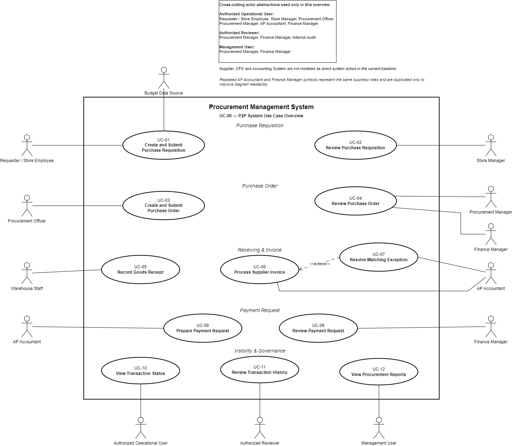
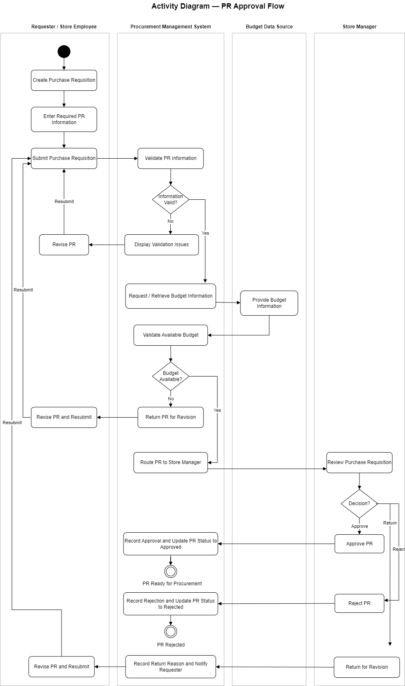
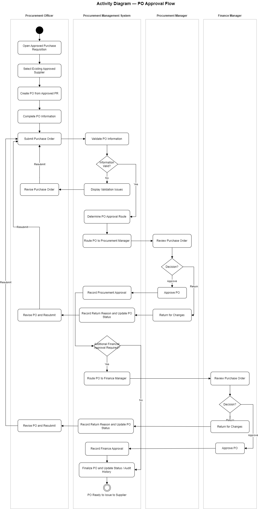
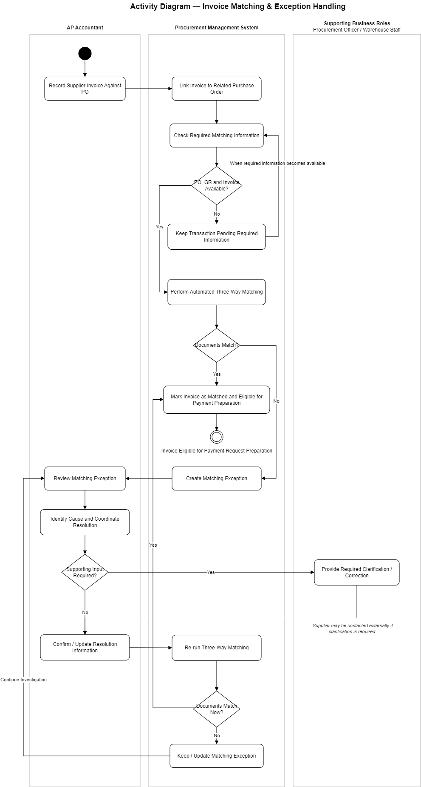

# 06 — System Analysis

## 1. Overview

This section translates the approved business requirements and To-Be Procure-to-Pay process into a structured **system interaction model** for the proposed **Procurement Management System**.

The analysis focuses on:

- defining the system boundary;
- identifying direct system actors;
- modeling user goals through UML Use Cases;
- documenting detailed Use Case scenarios;
- modeling key decision-heavy workflows through UML Activity Diagrams;
- preserving traceability from Business Requirements to future Functional and Non-Functional Requirements.

The System Analysis covers the process from **Purchase Requisition creation** through **Payment Request approval**.

> **Scope boundary:** Actual bank payment execution is outside the scope of this case study.

---

## 2. System Boundary

### System Under Analysis

**Procurement Management System**

The system supports the following business capabilities:

- Purchase Requisition creation and submission;
- required-information validation;
- budget validation orchestration;
- Purchase Requisition approval;
- Purchase Order creation from approved PR data;
- approved supplier selection;
- Purchase Order approval routing;
- Goods Receipt recording;
- Supplier Invoice processing;
- three-way matching between PO, GR, and Invoice;
- matching exception handling;
- Payment Request preparation and approval;
- transaction status visibility;
- transaction and approval history;
- basic procurement reporting.

### External / Supporting Dependencies

The current model includes **Budget Data Source** as an external supporting system because budget information is required for automated budget validation.

The following elements are intentionally not modeled as direct system actors:

- **Supplier** — remains an external business participant; Supplier Portal is outside scope.
- **CFO** — Executive Sponsor, not a day-to-day operational system user.
- **Accounting System** — remains an existing dependency, but the detailed integration interface has not yet been defined.

---

## 3. System Actors

| ID | Actor | Role |
|---|---|---|
| ACT-01 | Requester / Store Employee | Creates and submits Purchase Requisitions |
| ACT-02 | Store Manager | Reviews and makes business approval decisions on Purchase Requisitions |
| ACT-03 | Procurement Officer | Processes approved PRs and creates/manages Purchase Orders |
| ACT-04 | Procurement Manager | Reviews and approves or returns Purchase Orders |
| ACT-05 | Warehouse Staff | Records Goods Receipt against approved Purchase Orders |
| ACT-06 | AP Accountant | Processes Supplier Invoices, matching exceptions, and Payment Requests |
| ACT-07 | Finance Manager | Performs conditional financial PO review and approves Payment Requests |
| ACT-08 | Internal Audit | Reviews transaction and approval history |
| ACT-09 | Budget Data Source | Provides budget information required for budget validation |

---

## 4. Use Case Model

### 4.1 System Use Case Overview

The overview diagram presents the major system goals and their primary actors without reproducing the full end-to-end business sequence already documented in BPMN.



> Use Case relationships describe actor goals and system interaction. Process sequence is modeled separately in BPMN and Activity Diagrams.

### 4.2 Use Case Catalog

| ID | Use Case | Primary Actor | Diagram |
|---|---|---|---|
| UC-01 | Create and Submit Purchase Requisition | Requester / Store Employee | [View](./diagrams/use-case/UC-01.drawio.png) |
| UC-02 | Review Purchase Requisition | Store Manager | [View](./diagrams/use-case/UC-02.drawio.png) |
| UC-03 | Create and Submit Purchase Order | Procurement Officer | [View](./diagrams/use-case/UC-03.drawio.png) |
| UC-04 | Review Purchase Order | Procurement Manager | [View](./diagrams/use-case/UC-04.drawio.png) |
| UC-05 | Record Goods Receipt | Warehouse Staff | [View](./diagrams/use-case/UC-05.drawio.png) |
| UC-06 | Process Supplier Invoice | AP Accountant | [View](./diagrams/use-case/UC-06.drawio.png) |
| UC-07 | Resolve Matching Exception | AP Accountant | [View](./diagrams/use-case/UC-07.drawio.png) |
| UC-08 | Prepare Payment Request | AP Accountant | [View](./diagrams/use-case/UC-08.drawio.png) |
| UC-09 | Review Payment Request | Finance Manager | [View](./diagrams/use-case/UC-09.drawio.png) |
| UC-10 | View Transaction Status | Authorized Operational Users | [View](./diagrams/use-case/UC-10.drawio.png) |
| UC-11 | Review Transaction History | Authorized Reviewers / Internal Audit | [View](./diagrams/use-case/UC-11.drawio.png) |
| UC-12 | View Procurement Reports | Procurement Manager / Finance Manager | [View](./diagrams/use-case/UC-12.drawio.png) |

### 4.3 Detailed Use Case Specifications

Detailed specifications for UC-01 through UC-12 are consolidated into one document for easier navigation and review:

**[View Use Case Specifications](./use-case-specifications.md)**

Each specification includes:

- goal and trigger;
- primary and supporting actors;
- preconditions;
- main flow;
- alternative / exception flows;
- postconditions;
- related Business Requirements;
- related Business Rules;
- relevant open decisions and modeling notes.

---

## 5. Activity Diagrams

Activity Diagrams are used only for workflows where decisions, routing, or exception loops require more behavioral detail than the Use Case Diagram alone can provide.

### 5.1 PR Approval Flow

This diagram covers:

- PR creation and submission;
- required-information validation;
- budget validation;
- Store Manager review;
- Approve / Reject / Return for Revision outcomes;
- correction and resubmission loops.



**Key control:** Budget validation must succeed before the PR can proceed to business approval.

---

### 5.2 PO Approval Flow

This diagram covers:

- PO creation from an approved PR;
- selection of an existing approved supplier;
- PO validation;
- approval-route determination;
- Procurement Manager review;
- conditional Finance Manager review;
- return, correction, and resubmission;
- PO finalization after all required approvals.



**Key control:** Finance approval is conditional and is required only when the applicable approval criteria are met.

---

### 5.3 Invoice Matching & Exception Handling

This diagram covers:

- Supplier Invoice recording;
- linkage to the related PO;
- availability of PO, GR, and Invoice information;
- automated three-way matching;
- successful-match path;
- matching exception creation;
- exception investigation and correction;
- re-running the match;
- eligibility for Payment Request preparation.



**Key control:** An invoice cannot proceed through the normal payment-preparation path until the applicable matching controls have been satisfied.

---

## 6. Key Modeling Decisions

The System Analysis follows the business baseline established in the previous phases.

### Purchase Requisition

- Budget validation is performed before Store Manager approval.
- The Store Manager performs the business approval decision, not the budget calculation.
- A failed budget validation prevents the PR from progressing.
- A returned PR must be revised and resubmitted.

### Purchase Order

- A PO must originate from an approved PR.
- Applicable PR data is reused when creating the PO.
- Supplier selection is restricted to an existing approved Supplier Master.
- Procurement Manager approval is part of the standard PO approval process.
- Additional Finance approval is conditional.
- A PO cannot be issued until all required approvals are completed.

### Goods Receipt and Invoice Matching

- Goods Receipt must reference an approved PO.
- Supplier Invoice processing is limited to PO-based purchases in the current scope.
- Three-way matching evaluates PO, GR, and Invoice information.
- A mismatch creates a controlled exception.
- Matching exceptions must be resolved before the transaction can normally proceed to payment preparation.

### Payment Request

- AP Accountant prepares the Payment Request.
- Finance Manager performs the final Payment Request approval.
- **Payment Request Approved** is the end of the modeled Procure-to-Pay scope.
- Bank payment execution and reconciliation are outside scope.

### Visibility and Governance

- Authorized users can view relevant transaction status.
- Key actions and approval decisions are retained in transaction history.
- Internal Audit has a review role rather than an operational approval role.
- Detailed role permissions will be refined later.

---

## 7. Open Business Decisions

The following items remain intentionally unresolved and must not be treated as confirmed system rules:

| ID | Open Decision |
|---|---|
| OD-01 | Exact Purchase Order approval monetary thresholds |
| OD-02 | Criteria requiring additional Finance approval |
| OD-03 | Detailed budget-validation policy |
| OD-04 | Three-way matching tolerance policy and values, if applicable |
| OD-05 | Matching-exception escalation rules |
| OD-06 | Final procurement transaction status model |
| OD-07 | Detailed role permissions |
| OD-08 | Partial Goods Receipt policy |

These decisions will be refined during detailed requirements analysis and stakeholder validation.

---

## 8. Business Requirement to Use Case Traceability

| Business Requirement | Related Use Cases |
|---|---|
| BRQ-01 — Connected Procure-to-Pay Transaction Management | UC-01, UC-03, UC-05, UC-06, UC-08 |
| BRQ-02 — Standardized Purchase Requisition Management | UC-01, UC-02 |
| BRQ-03 — Mandatory Budget Control | UC-01, UC-02 |
| BRQ-04 — Controlled Supplier Selection | UC-03 |
| BRQ-05 — Standardized Purchase Order Management and Approval | UC-03, UC-04 |
| BRQ-06 — Procurement Data Reuse and Transaction Linkage | UC-03, UC-05, UC-06, UC-10 |
| BRQ-07 — Procurement Status Visibility | UC-10, UC-12 |
| BRQ-08 — Controlled Three-Way Matching and Exception Handling | UC-05, UC-06, UC-07 |
| BRQ-09 — Transaction and Approval Traceability | Cross-cutting across transactional Use Cases; UC-11 provides the dedicated review capability |
| BRQ-10 — Controlled Payment Request Approval | UC-08, UC-09 |
| BRQ-11 — Basic Procurement Reporting | UC-12 |

This mapping provides the bridge from the Business Requirements Document to the detailed system requirements that will be defined in the SRS.

---

## 9. Deliverables

```text
06-system-analysis/
├── README.md
├── use-case-specifications.md
│
└── diagrams/
    ├── use-case/
    │   ├── UC-00.drawio.png
    │   ├── UC-01.drawio.png
    │   ├── UC-02.drawio.png
    │   ├── UC-03.drawio.png
    │   ├── UC-04.drawio.png
    │   ├── UC-05.drawio.png
    │   ├── UC-06.drawio.png
    │   ├── UC-07.drawio.png
    │   ├── UC-08.drawio.png
    │   ├── UC-09.drawio.png
    │   ├── UC-10.drawio.png
    │   ├── UC-11.drawio.png
    │   └── UC-12.drawio.png
    │
    └── activity/
        ├── activity-pr-approval.png
        ├── activity-po-approval.png
        └── activity-invoice-matching.png
```

---

## 10. Transition to SRS

The System Analysis establishes **what users need to accomplish with the Procurement Management System and how the key workflows behave**.

The next stage will translate this analysis into the **Software Requirements Specification (SRS)**:

```text
Business Requirement (BRQ)
        ↓
Use Case / Business Scenario
        ↓
Functional Requirement (FR)
        ↓
Non-Functional Requirement (NFR)
        ↓
Acceptance Criteria
        ↓
Traceability / Validation
```

The SRS will define detailed Functional and Non-Functional Requirements without changing the business scope established in the BRD and System Analysis.
