# Use Case Specifications

## 1. Purpose

This document consolidates the Use Case Model and detailed Use Case Specifications for the **NovaRetail Procurement Management System**.

The system scope covers the Procure-to-Pay process from **Purchase Requisition creation** through **Payment Request approval**. Actual bank payment execution, supplier onboarding, RFQ/RFP, contract management, and full ERP/accounting replacement are outside the scope of this case study.

The document is organized as follows:

- UC-00: System Use Case Overview
- UC-01 to UC-12: Detailed business use cases
- Each use case includes its corresponding diagram exported from Draw.io

> **Modeling note:** Use Case diagrams describe actor goals and system interactions. End-to-end process sequence is modeled separately in BPMN.

---

## 2. UC-00 — P2P System Use Case Overview

### 2.1 System Boundary

**System under analysis:** Procurement Management System

The system supports Purchase Requisition creation and approval, budget validation orchestration, Purchase Order creation and approval, Goods Receipt recording, Supplier Invoice processing, automated three-way matching, matching exception handling, Payment Request preparation and approval, transaction status visibility, transaction history and auditability, and basic procurement reporting.

### 2.2 Core Actors

| Actor | Role in the System |
|---|---|
| Requester / Store Employee | Creates and submits Purchase Requisitions |
| Store Manager | Reviews and makes business approval decisions on Purchase Requisitions |
| Procurement Officer | Processes approved PRs and creates Purchase Orders |
| Procurement Manager | Reviews and approves or returns Purchase Orders |
| Warehouse Staff | Records Goods Receipt against approved Purchase Orders |
| AP Accountant | Processes Supplier Invoices, matching exceptions, and Payment Requests |
| Finance Manager | Performs conditional financial PO review and approves Payment Requests |
| Internal Audit | Reviews transaction and approval history |
| Budget Data Source | Provides budget information required for automated budget validation |

### 2.3 Actors Not Modeled as Direct System Users

- **Supplier:** External business participant, but Supplier Portal is outside scope.
- **CFO:** Executive Sponsor, not a day-to-day system actor.
- **Accounting System:** Existing dependency, but the detailed integration interface is not yet defined.

### 2.4 Use Case Catalog

| ID | Use Case | Primary Actor |
|---|---|---|
| UC-01 | Create and Submit Purchase Requisition | Requester / Store Employee |
| UC-02 | Review Purchase Requisition | Store Manager |
| UC-03 | Create and Submit Purchase Order | Procurement Officer |
| UC-04 | Review Purchase Order | Procurement Manager |
| UC-05 | Record Goods Receipt | Warehouse Staff |
| UC-06 | Process Supplier Invoice | AP Accountant |
| UC-07 | Resolve Matching Exception | AP Accountant |
| UC-08 | Prepare Payment Request | AP Accountant |
| UC-09 | Review Payment Request | Finance Manager |
| UC-10 | View Transaction Status | Authorized Operational Users |
| UC-11 | Review Transaction History | Authorized Reviewers / Internal Audit |
| UC-12 | View Procurement Reports | Procurement Manager / Finance Manager |

---

# 3. Detailed Use Case Specifications

## UC-01 — Create and Submit Purchase Requisition

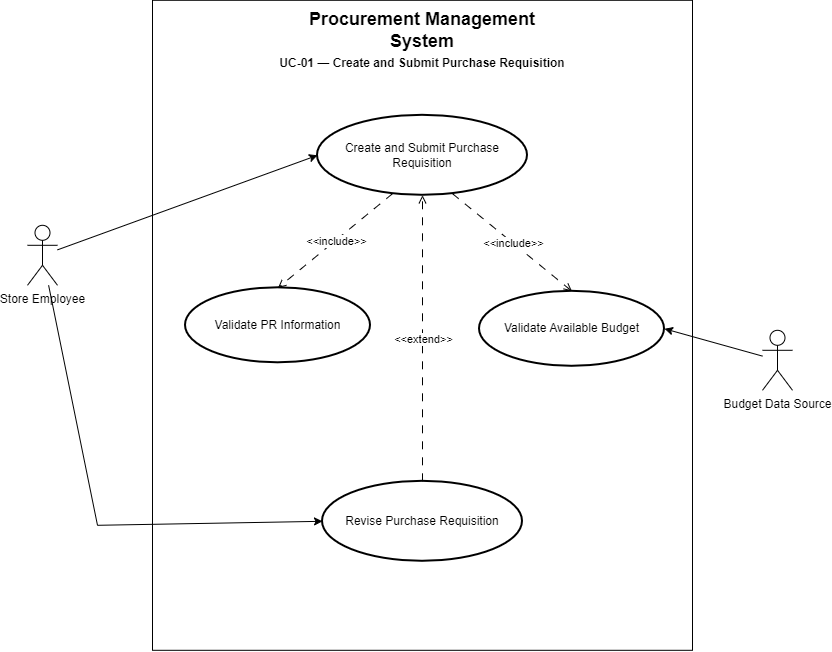

### Use Case Summary

| Item | Description |
|---|---|
| **Use Case ID** | UC-01 |
| **Use Case Name** | Create and Submit Purchase Requisition |
| **Primary Actor** | Requester / Store Employee |
| **Supporting Actor** | Budget Data Source |
| **Goal** | Create a Purchase Requisition, provide the required purchasing information, and submit it for business approval after successful validation and budget control. |
| **Trigger** | The Requester identifies a purchasing need. |
| **Related BRQs** | BRQ-02, BRQ-03, BRQ-09 |
| **Related Business Rules** | BR-01, BR-02, BR-03, BR-25, BR-26 |

### Preconditions

1. The Requester is an authorized system user.
2. The Requester is associated with a valid store, department, and/or cost center as applicable.
3. Budget information is available to the procurement process.

### Main Flow

1. The Requester starts a new Purchase Requisition.
2. The Requester enters the required purchasing information.
3. The Requester submits the Purchase Requisition.
4. The system validates the required PR information.
5. The system requests or obtains the applicable budget information.
6. The system validates the available budget.
7. The budget validation succeeds.
8. The system records the submission action and updates the PR status.
9. The PR is routed for business approval by the Store Manager.

### Alternative Flow A1 — Invalid or Missing PR Information

1. The Requester submits the PR.
2. The system detects missing or invalid required information.
3. The system displays the validation issues.
4. The PR does not proceed to approval.
5. The Requester corrects the information and resubmits the PR.

### Alternative Flow A2 — Insufficient Budget

1. The system performs budget validation.
2. Available budget is insufficient.
3. The PR is prevented from proceeding to business approval.
4. The system returns the PR for revision.
5. The Requester revises the PR and resubmits it.
6. Required validation is performed again.

### Alternative Flow A3 — PR Returned After Business Review

1. The Store Manager returns the PR for revision through UC-02.
2. The Requester opens the returned PR.
3. The Requester revises the required information.
4. The Requester resubmits the PR.
5. The system performs the required validations again.

### Postconditions

**Success**
- The PR is submitted successfully.
- Required information is valid.
- Budget validation has succeeded.
- The PR is ready for Store Manager review.
- The submission action is retained in transaction history.

**Failure / Incomplete**
- The PR remains unavailable for business approval until validation issues are resolved.

### Notes

- Budget validation is a system control; the Store Manager does not manually perform the budget calculation.
- No Finance Manager override for insufficient budget is assumed.
- Detailed field definitions are deferred to the SRS.

---

## UC-02 — Review Purchase Requisition

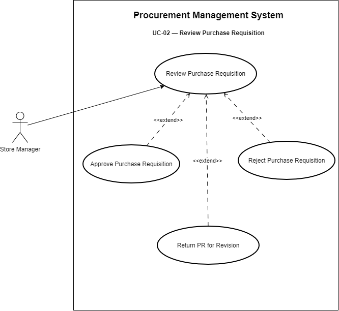

### Use Case Summary

| Item | Description |
|---|---|
| **Use Case ID** | UC-02 |
| **Use Case Name** | Review Purchase Requisition |
| **Primary Actor** | Store Manager |
| **Goal** | Review a validated Purchase Requisition and make the required business approval decision. |
| **Trigger** | A submitted and budget-validated PR is routed to the Store Manager. |
| **Related BRQs** | BRQ-02, BRQ-03, BRQ-09 |
| **Related Business Rules** | BR-02, BR-04, BR-05, BR-25, BR-26 |

### Preconditions

1. The PR has been submitted.
2. Required PR information has passed validation.
3. Applicable budget validation has succeeded.
4. The PR is awaiting business approval.
5. The Store Manager is authorized to review the PR.

### Main Flow — Approve PR

1. The Store Manager opens the pending PR.
2. The system displays the PR information relevant to the approval decision.
3. The Store Manager reviews the purchasing need.
4. The Store Manager selects **Approve**.
5. The system records the approval decision, approver, and timestamp.
6. The PR status is updated to the applicable approved state.
7. The approved PR becomes available for Procurement processing.

### Alternative Flow A1 — Reject PR

1. The Store Manager reviews the PR.
2. The Store Manager selects **Reject**.
3. The system records the rejection decision.
4. The PR is updated to the applicable rejected state.
5. The PR does not proceed to Procurement processing.

### Alternative Flow A2 — Return PR for Revision

1. The Store Manager reviews the PR.
2. The Store Manager selects **Return for Revision**.
3. The system records the return decision and relevant reason/comment.
4. The PR is returned to the Requester.
5. The Requester revises and resubmits the PR through UC-01.

### Postconditions

**Approved** — The PR is approved and available for Procurement processing.

**Rejected** — The PR does not continue in the procurement workflow.

**Returned** — The PR is returned to the Requester for correction.

### Notes

- Budget validation is completed before this Use Case.
- The Store Manager performs the business approval decision, not the automated budget control.

---

## UC-03 — Create and Submit Purchase Order

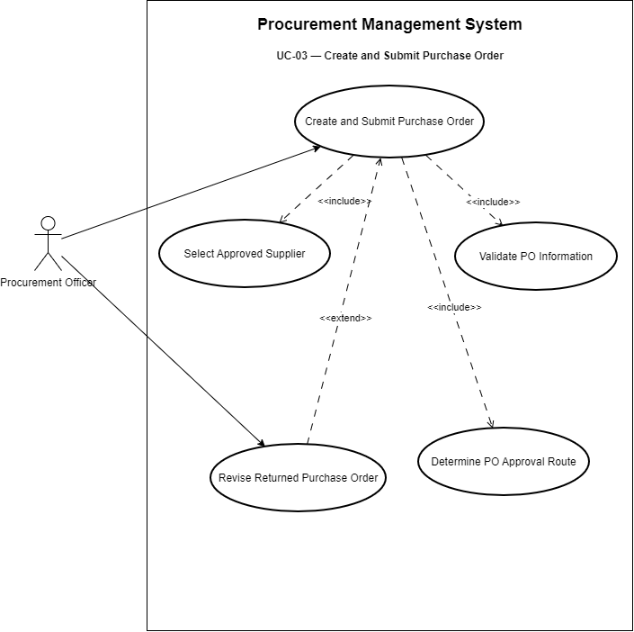

### Use Case Summary

| Item | Description |
|---|---|
| **Use Case ID** | UC-03 |
| **Use Case Name** | Create and Submit Purchase Order |
| **Primary Actor** | Procurement Officer |
| **Goal** | Create a Purchase Order from an approved PR, select an existing approved supplier, complete PO information, and submit the PO for approval. |
| **Trigger** | An approved PR is ready for Procurement processing. |
| **Related BRQs** | BRQ-04, BRQ-05, BRQ-06, BRQ-09 |
| **Related Business Rules** | BR-05, BR-06, BR-07, BR-08, BR-09, BR-12, BR-25, BR-26 |

### Preconditions

1. The source PR has been approved.
2. The Procurement Officer is authorized to process the PR.
3. Approved Supplier Master information is available.
4. The PR contains the information required to initiate PO creation.

### Main Flow

1. The Procurement Officer opens an approved PR.
2. The system displays the PR and its relevant purchasing information.
3. The Procurement Officer selects an existing approved supplier.
4. The system creates or initializes a PO from the approved PR.
5. Applicable PR information is reused in the PO.
6. The Procurement Officer completes PO-specific information such as supplier, pricing, commercial, and delivery information as applicable.
7. The Procurement Officer submits the PO.
8. The system validates required PO information.
9. The system evaluates the applicable approval rules.
10. The system determines the required approval route.
11. The PO is routed to the appropriate approver.

### Alternative Flow A1 — Invalid PO Information

1. The Procurement Officer submits the PO.
2. The system detects missing or invalid required information.
3. The system displays the validation issues.
4. The PO remains unavailable for approval.
5. The Procurement Officer corrects the PO and resubmits it.

### Alternative Flow A2 — PO Returned for Changes

1. An approver returns the PO through UC-04.
2. The Procurement Officer opens the returned PO.
3. The Procurement Officer reviews the return reason.
4. The Procurement Officer corrects the required information.
5. The Procurement Officer resubmits the PO.
6. The approval route is evaluated again as applicable.

### Postconditions

- The PO has been created from an approved PR.
- The source PR reference is retained.
- Applicable PR information has been reused.
- An approved Supplier Master supplier has been selected.
- The PO is submitted into the approval workflow.

### Notes

- Supplier onboarding, supplier qualification, RFQ/RFP, and tendering are outside scope.
- Exact approval thresholds are not defined in this Use Case.

---

## UC-04 — Review Purchase Order

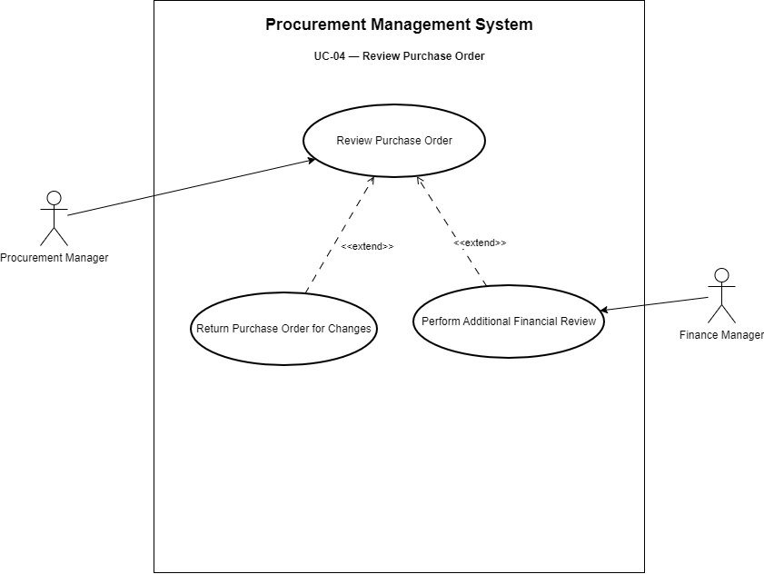

### Use Case Summary

| Item | Description |
|---|---|
| **Use Case ID** | UC-04 |
| **Use Case Name** | Review Purchase Order |
| **Primary Actor** | Procurement Manager |
| **Conditional Actor** | Finance Manager |
| **Goal** | Complete the required PO approval process before the PO can be issued. |
| **Trigger** | A submitted PO is routed for approval. |
| **Related BRQs** | BRQ-05, BRQ-09 |
| **Related Business Rules** | BR-09, BR-10, BR-11, BR-12, BR-25, BR-26 |

### Preconditions

1. The PO has been submitted.
2. Required PO information has passed validation.
3. The applicable approval route has been determined.
4. The approver is authorized for the applicable approval step.

### Main Flow — Procurement Approval

1. The Procurement Manager opens the pending PO.
2. The system displays the PO and relevant source transaction information.
3. The Procurement Manager reviews the PO.
4. The Procurement Manager approves the PO.
5. The system records the approval decision.
6. The system determines whether additional Finance approval is required.

### Main Flow Continuation A — No Additional Finance Approval Required

7. No additional Finance approval is required.
8. All required approvals are complete.
9. The system updates the PO to the applicable approved/finalized status.
10. The approved PO becomes eligible to be issued to the Supplier.

### Main Flow Continuation B — Additional Finance Approval Required

7. The system routes the PO to the Finance Manager.
8. The Finance Manager reviews the PO from the financial control perspective.
9. The Finance Manager approves the PO.
10. The system records the Finance approval.
11. All required approvals are complete.
12. The PO becomes eligible to be issued to the Supplier.

### Alternative Flow A1 — Procurement Manager Returns PO

1. The Procurement Manager reviews the PO.
2. The Procurement Manager selects **Return for Changes**.
3. The system records the decision and relevant reason/comment.
4. The PO returns to the Procurement Officer.
5. The Procurement Officer corrects and resubmits the PO through UC-03.

### Alternative Flow A2 — Finance Manager Returns PO

1. Additional financial approval is required.
2. The Finance Manager reviews the PO.
3. The Finance Manager selects **Return for Changes**.
4. The system records the return decision.
5. The PO returns to the Procurement Officer for correction.
6. The PO must be resubmitted through the applicable approval workflow.

### Postconditions

**Approved** — All required PO approvals are complete, approval history is retained, and the PO is ready to be issued externally.

**Returned** — The PO is returned to Procurement for correction.

### Open Decisions

- **OD-01:** Exact PO approval monetary thresholds.
- **OD-02:** Criteria requiring additional Finance approval.

### Notes

- Finance Manager participation is conditional, not mandatory for every PO.
- A PO must not be issued until all required approvals are completed.

---

## UC-05 — Record Goods Receipt

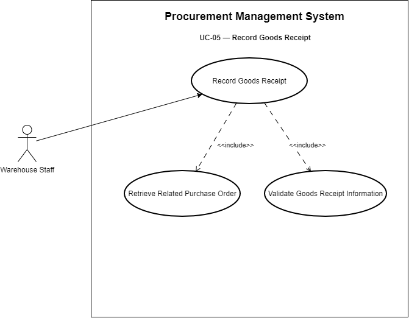

### Use Case Summary

| Item | Description |
|---|---|
| **Use Case ID** | UC-05 |
| **Use Case Name** | Record Goods Receipt |
| **Primary Actor** | Warehouse Staff |
| **Goal** | Record the actual receipt of goods against the correct approved PO. |
| **Trigger** | Goods are delivered for an approved Purchase Order. |
| **Related BRQs** | BRQ-06, BRQ-08, BRQ-09 |
| **Related Business Rules** | BR-13, BR-14, BR-25, BR-26 |

### Preconditions

1. A valid approved PO exists.
2. Goods have been received.
3. Warehouse Staff is authorized to record Goods Receipt.

### Main Flow

1. Warehouse Staff identifies or searches for the related approved PO.
2. The system displays relevant PO information.
3. Warehouse Staff checks the delivered quantity and condition.
4. Warehouse Staff enters the Goods Receipt information.
5. The system validates the Goods Receipt information.
6. Warehouse Staff submits the Goods Receipt.
7. The system records the GR against the PO.
8. The system updates the related procurement transaction information.
9. The GR becomes available for downstream invoice matching.

### Alternative Flow A1 — Invalid Goods Receipt Information

1. Warehouse Staff submits the GR.
2. The system detects missing or invalid information.
3. The system displays the validation issues.
4. The GR is not finalized.
5. Warehouse Staff corrects and resubmits the information.

### Postconditions

- A Goods Receipt is recorded against the correct PO.
- The GR is available for three-way matching.
- The transaction history is updated.

### Open Decisions

- **OD-08:** Partial Goods Receipt policy.

### Notes

- Detailed Warehouse Management System functionality is outside scope.
- Partial Goods Receipt is not assumed as a confirmed rule until OD-08 is resolved.

---

## UC-06 — Process Supplier Invoice

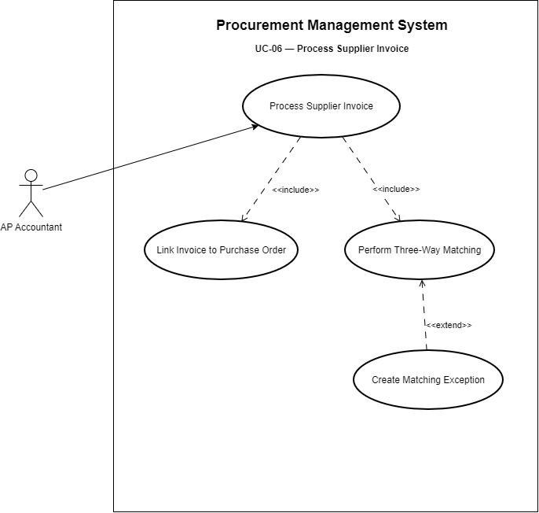

### Use Case Summary

| Item | Description |
|---|---|
| **Use Case ID** | UC-06 |
| **Use Case Name** | Process Supplier Invoice |
| **Primary Actor** | AP Accountant |
| **Goal** | Record a Supplier Invoice, link it to the related procurement transaction, and process it through three-way matching. |
| **Trigger** | AP receives a Supplier Invoice related to a PO-based purchase. |
| **Related BRQs** | BRQ-06, BRQ-08, BRQ-09 |
| **Related Business Rules** | BR-15, BR-16, BR-17, BR-18, BR-19, BR-20, BR-25, BR-26 |

### Preconditions

1. The purchase is within the PO-based procurement scope.
2. The related PO exists.
3. AP Accountant is authorized to process the invoice.

### Main Flow — Successful Match

1. AP Accountant opens Supplier Invoice processing.
2. AP Accountant records the Supplier Invoice information.
3. The invoice is linked to the related PO.
4. The system checks whether the required PO, GR, and Invoice information is available.
5. When the required information is available, the system performs three-way matching.
6. The system compares the predefined matching attributes.
7. The documents satisfy the applicable matching rules.
8. The system marks the invoice/transaction as successfully matched.
9. The invoice becomes eligible for Payment Request preparation.

### Alternative Flow A1 — Required Matching Information Not Available

1. The invoice is recorded.
2. Required PO, GR, or Invoice information is not yet available.
3. Automated matching cannot be completed.
4. The transaction remains pending the required information.
5. Matching is performed when the required information becomes available.

### Alternative Flow A2 — Matching Fails

1. The system performs three-way matching.
2. One or more applicable values do not match.
3. The system creates a Matching Exception.
4. The transaction does not proceed to Payment Request preparation.
5. The exception is handled through UC-07.

### Postconditions

**Matched** — The invoice is successfully matched and eligible for Payment Request preparation.

**Mismatch** — A Matching Exception exists and the transaction is blocked from normal Payment Request preparation until the exception is resolved according to policy.

### Open Decisions

- **OD-04:** Three-way matching tolerance policy and values, if tolerances are adopted.

### Notes

- Matching may conceptually compare supplier, item, quantity, unit price, and/or total amount as applicable.
- **BR-18 is conditional:** matching tolerance must not be assumed unless NovaRetail adopts an approved tolerance policy.

---

## UC-07 — Resolve Matching Exception

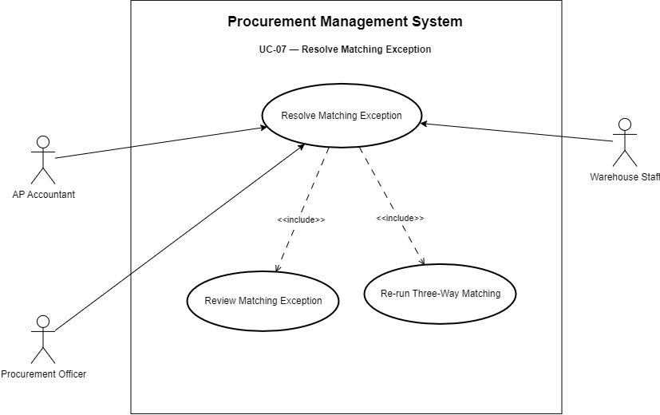

### Use Case Summary

| Item | Description |
|---|---|
| **Use Case ID** | UC-07 |
| **Use Case Name** | Resolve Matching Exception |
| **Primary Actor** | AP Accountant |
| **Supporting Actors** | Procurement Officer, Warehouse Staff |
| **Goal** | Investigate and resolve a failed three-way match so the transaction can be evaluated again. |
| **Trigger** | The system creates a Matching Exception after a failed match. |
| **Related BRQs** | BRQ-08, BRQ-09 |
| **Related Business Rules** | BR-20, BR-21, BR-22, BR-25, BR-26 |

### Preconditions

1. A Matching Exception exists.
2. The exception is associated with a procurement transaction.
3. AP Accountant is authorized to review the exception.

### Main Flow

1. AP Accountant opens the Matching Exception.
2. The system displays the mismatch information and related transaction references.
3. AP Accountant reviews the mismatch.
4. AP Accountant identifies the likely cause.
5. AP Accountant coordinates with Procurement Officer and/or Warehouse Staff as required.
6. Relevant information is corrected or updated through the appropriate business process.
7. The resolution action and relevant history are recorded.
8. AP Accountant initiates or requests re-evaluation.
9. The system re-runs the applicable three-way matching logic.
10. The documents now satisfy the matching rules.
11. The exception is resolved.
12. The invoice becomes eligible for the next controlled step.

### Alternative Flow A1 — Exception Remains Unresolved

1. The system re-runs matching.
2. The documents still do not satisfy the applicable matching rules.
3. The exception remains open or unresolved.
4. The transaction remains blocked from normal Payment Request preparation.
5. Further investigation is required.

### Alternative Flow A2 — Supplier Clarification Required

1. AP Accountant or Procurement identifies that Supplier clarification is required.
2. The Supplier is contacted outside the internal system interaction model.
3. Relevant information is obtained.
4. The internal transaction information is updated as appropriate.
5. Matching is re-run.

### Postconditions

**Resolved** — Exception status and resolution history are retained, the transaction is re-evaluated, and the invoice may proceed only if the applicable controls are satisfied.

**Unresolved** — The exception remains active and the invoice remains blocked from normal payment preparation.

### Open Decisions

- **OD-04:** Matching tolerance policy and values, if applicable.
- **OD-05:** Matching-exception escalation rules.
- **OD-08:** Partial Goods Receipt policy may affect quantity-related exceptions.

### Notes

- Supplier may participate operationally through external communication but is not modeled as a direct system actor.
- AP Accountant remains the primary owner of matching exception handling in this baseline.

---

## UC-08 — Prepare Payment Request

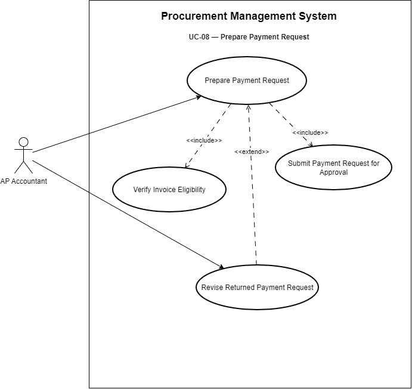

### Use Case Summary

| Item | Description |
|---|---|
| **Use Case ID** | UC-08 |
| **Use Case Name** | Prepare Payment Request |
| **Primary Actor** | AP Accountant |
| **Goal** | Prepare and submit a Payment Request for an invoice that has satisfied the required procurement controls. |
| **Trigger** | An invoice becomes eligible for payment preparation. |
| **Related BRQs** | BRQ-10, BRQ-09 |
| **Related Business Rules** | BR-19, BR-22, BR-25, BR-26 |

### Preconditions

1. The Supplier Invoice exists.
2. The invoice is eligible for payment preparation.
3. The invoice has either successfully completed applicable matching or completed an approved exception-resolution path according to the applicable control policy.
4. AP Accountant is authorized to prepare Payment Requests.

### Main Flow

1. AP Accountant identifies an eligible invoice.
2. AP Accountant starts Payment Request preparation.
3. The system verifies the invoice's eligibility.
4. The system provides the related procurement transaction references and supporting information.
5. AP Accountant completes the Payment Request information.
6. AP Accountant reviews the Payment Request.
7. AP Accountant submits the Payment Request for approval.
8. The system records the submission action.
9. The system routes the Payment Request to the authorized Finance approver.

### Alternative Flow A1 — Invoice Is Not Eligible

1. AP Accountant attempts to prepare or submit the Payment Request.
2. The system determines that the invoice has not satisfied the required controls.
3. The Payment Request is prevented from proceeding.
4. AP Accountant must resolve the underlying issue before resubmission.

### Alternative Flow A2 — Returned Payment Request

1. Finance Manager returns the Payment Request through UC-09.
2. AP Accountant opens the returned request.
3. AP Accountant reviews the return reason.
4. AP Accountant revises the required information.
5. AP Accountant resubmits the Payment Request.
6. The request is routed again for approval.

### Postconditions

- A valid Payment Request has been submitted for Finance approval.
- Submission history is retained.

### Notes

- Preparing a Payment Request is intentionally separated from Supplier Invoice processing because it is a distinct user goal and control point.

---

## UC-09 — Review Payment Request

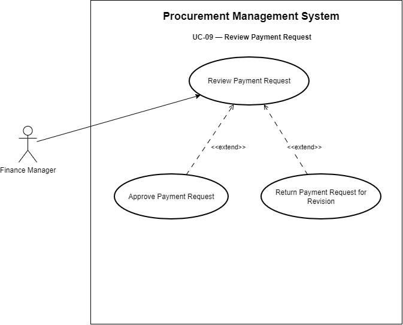

### Use Case Summary

| Item | Description |
|---|---|
| **Use Case ID** | UC-09 |
| **Use Case Name** | Review Payment Request |
| **Primary Actor** | Finance Manager |
| **Goal** | Review a submitted Payment Request and make the final approval decision within the project scope. |
| **Trigger** | A Payment Request is submitted and routed to Finance. |
| **Related BRQs** | BRQ-10, BRQ-09 |
| **Related Business Rules** | BR-23, BR-24, BR-25, BR-26 |

### Preconditions

1. A Payment Request has been submitted.
2. The request is linked to an eligible Supplier Invoice and supporting procurement transaction.
3. Finance Manager is authorized to perform the approval.

### Main Flow — Approve Payment Request

1. Finance Manager opens the pending Payment Request.
2. The system displays the Payment Request and relevant supporting transaction information.
3. Finance Manager reviews the request.
4. Finance Manager selects **Approve**.
5. The system records the approval decision, approver, and timestamp.
6. The Payment Request is updated to the applicable approved state.
7. The procurement workflow reaches its defined end point.

### Alternative Flow A1 — Return Payment Request for Revision

1. Finance Manager reviews the Payment Request.
2. Finance Manager identifies required corrections or clarification.
3. Finance Manager selects **Return for Revision**.
4. The system records the decision and relevant reason/comment.
5. The request returns to AP Accountant.
6. AP Accountant revises and resubmits it through UC-08.

### Postconditions

**Approved** — Payment Request is approved, approval history is retained, and the defined procurement case-study scope is complete.

**Returned** — The request is returned to AP for revision.

### Notes

- **Payment Request Approved is the end of project scope.**
- Actual bank payment execution, bank API integration, and payment reconciliation are outside scope.

---

## UC-10 — View Transaction Status

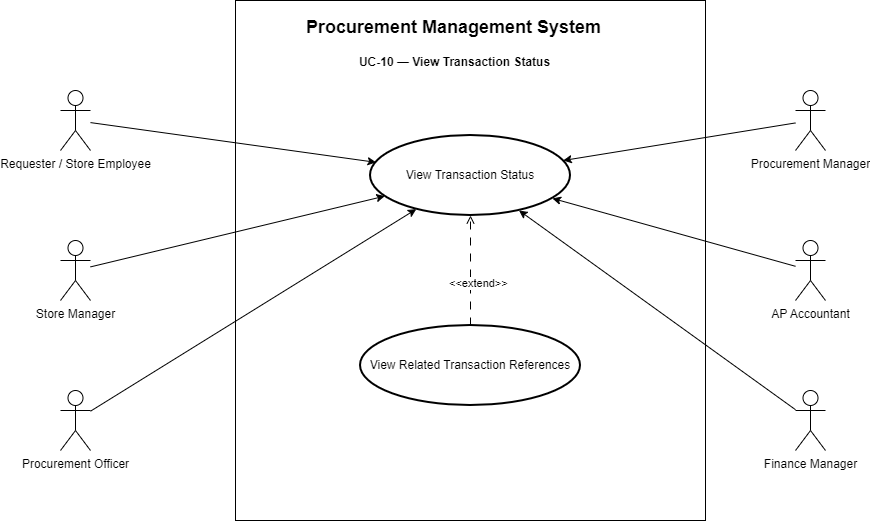

### Use Case Summary

| Item | Description |
|---|---|
| **Use Case ID** | UC-10 |
| **Use Case Name** | View Transaction Status |
| **Primary Actors** | Authorized Operational Users |
| **Goal** | View the current status and workflow position of relevant procurement transactions. |
| **Trigger** | An authorized user needs to determine the current state of a procurement transaction. |
| **Related BRQs** | BRQ-07, BRQ-06 |
| **Related Business Rules** | BR-25, BR-27 |

### Authorized Operational Users in the Current Baseline

- Requester / Store Employee
- Store Manager
- Procurement Officer
- Procurement Manager
- AP Accountant
- Finance Manager

Actual visibility may vary by role and permission.

### Preconditions

1. The user is authenticated.
2. The user has access to the relevant transaction information.
3. The requested procurement transaction exists.

### Main Flow

1. The user opens the transaction tracking or search capability.
2. The user identifies the relevant procurement transaction.
3. The system checks the user's access rights.
4. The system displays the current transaction status.
5. The system displays relevant workflow information, which may include current process stage, pending action, approval state, returned or rejected state, and related PR/PO/GR/Invoice/Payment Request references where applicable.
6. The user reviews the information.

### Alternative Flow A1 — Transaction Not Found

1. The user searches for a transaction.
2. No matching accessible transaction is found.
3. The system informs the user that no relevant result is available.

### Alternative Flow A2 — Access Not Authorized

1. The user attempts to access a transaction.
2. The system determines that the user does not have the required permission.
3. The restricted transaction information is not displayed.

### Postconditions

- No business transaction is modified.
- The user obtains the current status information permitted by their role.

### Open Decisions

- **OD-06:** Final procurement transaction status model.
- **OD-07:** Detailed role permissions.

### Notes

- The detailed list and naming of statuses are intentionally not frozen at this stage.

---

## UC-11 — Review Transaction History

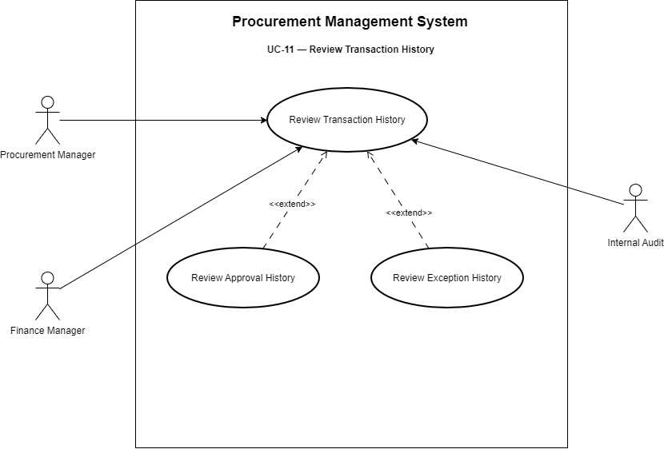

### Use Case Summary

| Item | Description |
|---|---|
| **Use Case ID** | UC-11 |
| **Use Case Name** | Review Transaction History |
| **Primary Actors** | Procurement Manager, Finance Manager, Internal Audit |
| **Goal** | Review historical actions, approvals, and exceptions associated with an in-scope procurement transaction. |
| **Trigger** | An authorized reviewer needs to investigate or verify transaction history. |
| **Related BRQs** | BRQ-09 |
| **Related Business Rules** | BR-21, BR-26, BR-27 |

### Preconditions

1. The user is authenticated.
2. The user has permission to review the relevant transaction history.
3. A relevant procurement transaction exists.

### Main Flow

1. The reviewer searches for or opens a procurement transaction.
2. The system verifies the reviewer's access rights.
3. The reviewer opens the transaction history.
4. The system displays the available history in chronological or otherwise understandable order.
5. The displayed history may include user/actor, action performed, timestamp, approval decision, previous/new status where applicable, matching exception events, exception resolution information, and related transaction references.
6. The reviewer examines the history.

### Alternative Flow A1 — No Accessible History

1. The reviewer selects a transaction.
2. No history is available or accessible under the current permissions.
3. The system displays the appropriate information without exposing restricted data.

### Postconditions

- Transaction history remains unchanged.
- The reviewer obtains the audit information permitted by their role.

### Open Decisions

- **OD-07:** Detailed role permissions.

### Notes

- Transaction history is read-only for the actors modeled in this Use Case.
- Other operational roles may receive limited history access later if approved by the business owners.

---

## UC-12 — View Procurement Reports

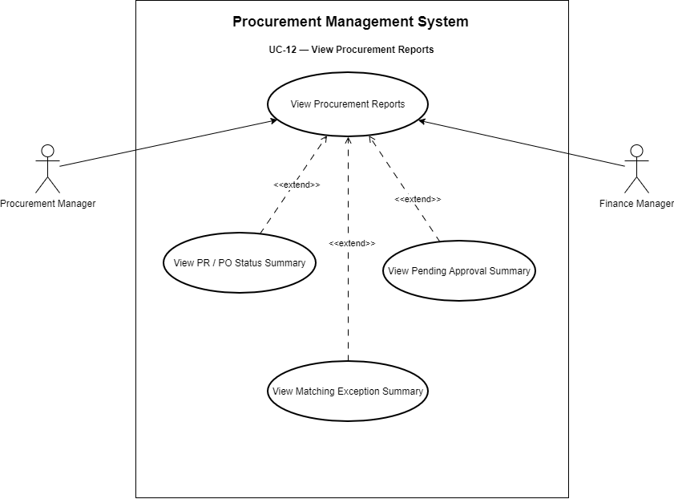

### Use Case Summary

| Item | Description |
|---|---|
| **Use Case ID** | UC-12 |
| **Use Case Name** | View Procurement Reports |
| **Primary Actors** | Procurement Manager, Finance Manager |
| **Goal** | View basic operational procurement information for process monitoring and management review. |
| **Trigger** | A manager needs summarized procurement information. |
| **Related BRQs** | BRQ-11, BRQ-07 |
| **Related Business Rules** | BR-25, BR-27 |

### Preconditions

1. The user is authenticated.
2. The user has access to procurement reporting.
3. Relevant procurement transaction data is available.

### Main Flow

1. The manager opens the procurement reporting capability.
2. The system verifies the user's access rights.
3. The system presents available basic procurement reports or summaries.
4. The manager selects the required report or information set.
5. The manager applies available filtering criteria where applicable.
6. The system presents the requested operational information.
7. The manager reviews the results.

### Report Subjects in the Current Business Baseline

The basic reporting capability may cover operational information such as Purchase Requisition status, Purchase Order status, pending approvals, Goods Receipt activity/status, Supplier Invoice status, matching exceptions, and Payment Request status.

### Alternative Flow A1 — No Data for Selected Criteria

1. The manager selects reporting criteria.
2. No accessible transaction data matches the criteria.
3. The system displays an empty result or appropriate no-data message.

### Alternative Flow A2 — Unauthorized Report Access

1. The user attempts to access restricted report information.
2. The system determines that the user does not have the required permission.
3. Restricted information is not displayed.

### Postconditions

- No procurement transaction is modified.
- The manager obtains the permitted operational information.

### Notes

- Exact dashboard layout, chart types, export formats, KPI formulas, and visual design are not defined at this stage.
- Detailed reporting requirements will be refined in the SRS and UI/Wireframe stages.

---

# 4. BRQ-to-Use-Case Coverage Summary

| Business Requirement | Related Use Cases |
|---|---|
| BRQ-01 — Connected Procure-to-Pay Transaction Management | UC-01, UC-03, UC-05, UC-06, UC-08 |
| BRQ-02 — Standardized Purchase Requisition Management | UC-01, UC-02 |
| BRQ-03 — Mandatory Budget Control | UC-01, UC-02 |
| BRQ-04 — Controlled Supplier Selection | UC-03 |
| BRQ-05 — Standardized Purchase Order Management and Approval | UC-03, UC-04 |
| BRQ-06 — Procurement Data Reuse and Transaction Linkage | UC-03, UC-05, UC-06, UC-10 |
| BRQ-07 — Procurement Status Visibility | UC-10, UC-12 |
| BRQ-08 — Controlled Three-Way Matching and Exception Handling | UC-05, UC-06, UC-07 |
| BRQ-09 — Transaction and Approval Traceability | UC-01–UC-09 as cross-cutting behavior, and UC-11 as the dedicated review capability |
| BRQ-10 — Controlled Payment Request Approval | UC-08, UC-09 |
| BRQ-11 — Basic Procurement Reporting | UC-12 |

---

# 5. Scope and Modeling Notes

- The process starts when an authorized Requester identifies a purchasing need and creates a Purchase Requisition.
- The modeled process ends when the Payment Request is approved.
- Actual bank payment execution is outside scope.
- Supplier selection is limited to existing approved suppliers.
- Supplier onboarding, qualification, RFQ/RFP, tendering, and Supplier Portal are outside scope.
- Budget creation and maintenance are outside scope; the Procurement Management System consumes available budget information.
- Detailed PO approval thresholds remain open.
- Detailed Finance approval criteria remain open.
- Matching tolerances are conditional and must not be assumed unless approved.
- Partial Goods Receipt policy remains open.
- Exact transaction statuses and detailed role permissions will be refined later.
- The SRS will contain detailed Functional and Non-Functional Requirements derived from these business use cases.
